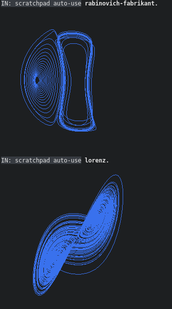
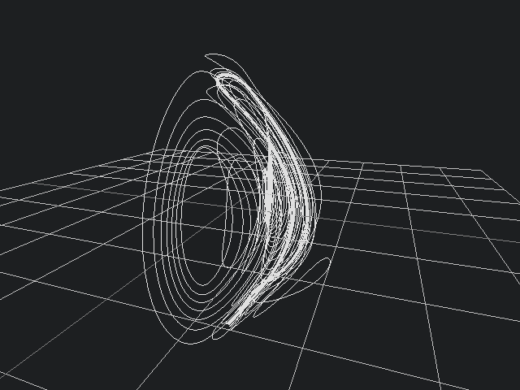
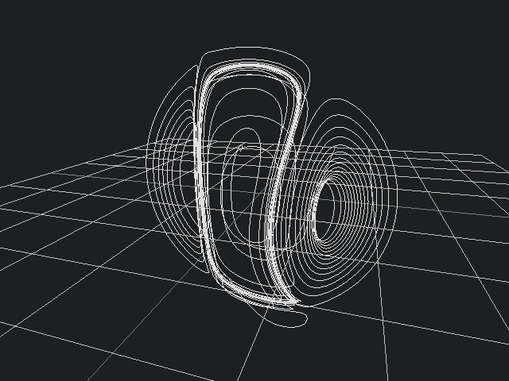
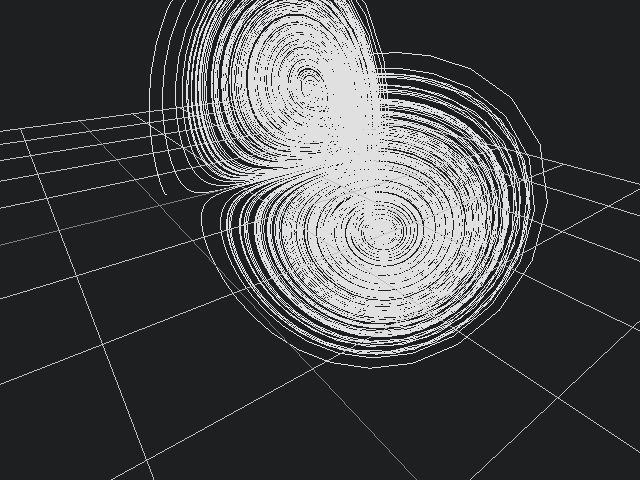
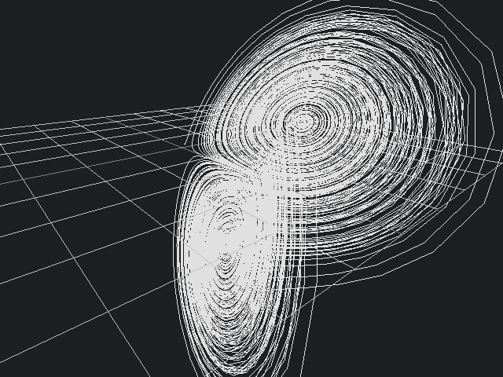

# rk4 first order differential approximated solution visualisation

runge-kutta 4 stage approximation implementation
uses factor ui.gadgets.charts library for in listener display and raylib.ffi for 3d visualisation

TODO:
- complicated composition reduction of the 4 equations should be done once at start instead of recursively
- replace some stack shuffling with lexical scoping

