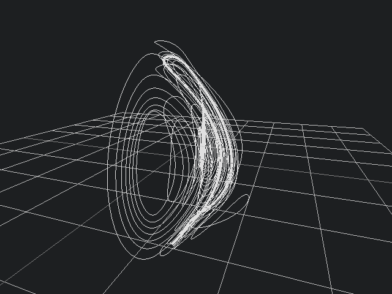
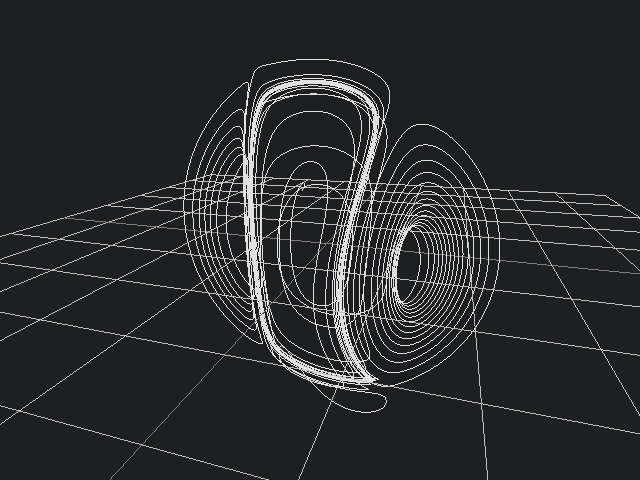

# rk4 first order differential approximated solution visualisation

runge-kutta 4 stage approximation implementation
uses factor ui.gadgets.charts library for in listener display and raylib.ffi for 3d visualisation
still buggy and unreadable and needs extending to n dimensions

